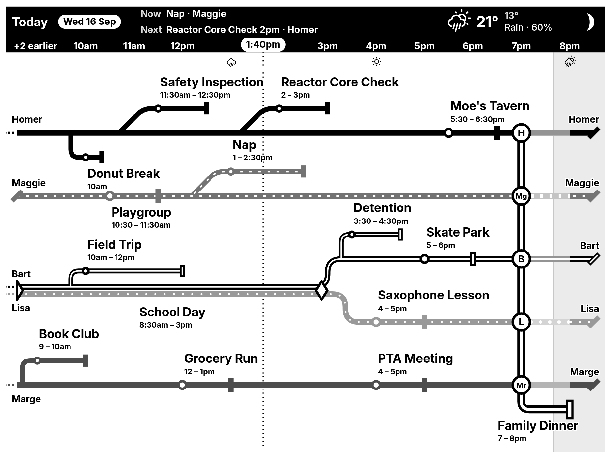

# Metro Calendar for TRMNL

Your family's day drawn as a transit map. One line per person runs across
the board under an hour strip; events are stops on their line, the people at
a shared event are joined across their lines, a holiday is named beside the
date and a day off is named at the line's head. The whole thing lays itself
out to the screen it lands on: TRMNL OG, OG V2, TRMNL X in landscape or
portrait, and every mashup size.



It runs entirely on TRMNL **Serverless**: `plugin/src/transform.js` fetches
your ICS feeds and normalises them, `plugin/src/shared.liquid` draws the map.
No server of your own.

## What it shows

- Today from six in the morning, stepping forward on the hour from 10:00
  (each step looking an hour back, with the past washed grey) and rolling on
  into tomorrow as the day runs out. What falls off the far end is counted
  on the hour strip ("+9 more"). Only the night is compressed: from
  midnight to a day's first event and from its last event to midnight.
- The hour strip is the header: each day's date, holiday, forecast and moon
  phase, the time now, and on a full view what is on now and next.
- Each line has a texture (solid, dotted, dashed, dash-dot) and, on
  grayscale and colour panels, a shade or colour, all picked for you. A
  shared calendar's own line (a "Family" feed) is a ladder.
- Events as stops with their time and name; tasks (VTODO) as square stops;
  several things at the same minute as one stop captioned as a list.
- A shared event as a hollow bar across its people's lines, a ring on each
  (with initials on a full view). Two people at something three hours or
  longer run their lines together instead. A line passing a bar with nothing
  on it there bridges it; otherwise the bar goes under it.
- One person's block of seven hours or more (a desk booking, a shift) as a
  light band behind their line.
- With a **Location**: the forecast, the hours before sunrise and after
  sunset shaded, and icons where rain starts or stops. An
  optional banner along the bottom warns of rain, snow, thunderstorms, cold
  or heat, and says when it starts and ends.
- English, French, Spanish, German, Dutch, Italian, Portuguese and Polish, following your TRMNL account
  language; 12- or 24-hour clocks.

## Setup

1. In TRMNL: **Plugins → Recipes**, find **Metro Calendar** and install it
   ([direct link](https://trmnl.com/recipes/471753)). Nothing to build or
   upload.
2. The plugin starts on an example day while **Calendars** is empty.
   **Example Day** picks which one; see [the demo folder](demo/) for what
   each shows.
3. To show your own calendars, paste their ICS links into **Calendars**,
   one per row, with a name in front of each:

   ```
   Alex  https://calendar.google.com/calendar/ical/…/basic.ics
   Sam   https://outlook.live.com/owa/calendar/…/calendar.ics
   Sam   webcal://p12-caldav.icloud.com/published/2/…
         https://…/family.ics
   https://…/holidays.ics holiday
   ```

   Each name is a line on the board; the same name twice puts two calendars
   on one line; a link with no name is the whole household's and shows on
   every line. Google's public-holiday calendars are recognised by their
   address; for another provider's, put `holiday` after the link. A link
   with no name at all, in a list with no names, is a line named as its
   service names the calendar.

   To route one shared feed to several people by rules (a school calendar
   with each child's class in the title), switch **Set Up With** to the
   setup helper and paste a JSON configuration into **Configuration**. Build it with the
   [Configuration editor](https://excusemi.github.io/trmnl-metro-calendar-plugin/tools/config-editor.html),
   which also previews the map at every device size, or write it by hand
   (see [CONFIG.md](CONFIG.md)). The editor opens as a step-by-step setup:
   who lives here, then one screen per calendar with click-by-click
   instructions for finding its link in Google Calendar, iCloud, Outlook,
   Nextcloud or Synology, and a check that reads the calendar back to you
   ("Found 14 appointments, the next is Swimming on Tuesday at 4") before it
   adds anything. It saves your answers in your browser as you go, and
   pasting back what TRMNL already has reopens it with every answer filled
   in. Add `?full` to the address for the old page with every control on it
   at once. No ICS links yet? The editor's **Examples**
   section has three presets (*Family of 4*, *Parent on Shifts*,
   *One Shared Calendar*): pick one, draw the map, then swap the
   placeholder links for your own.

   The quickest way to a board that reads like the examples is the
   editor's **AI prompt**: it describes the plugin, your calendars and what
   makes a board read well. Paste it into an assistant, paste the answer
   back, and you have a configuration that names the lines, routes a mixed
   feed to the right people and trims the titles, without writing a rule
   by hand. Each demo board is also a worked example:
   [demo/simpsons/config.json](demo/simpsons/config.json),
   [demo/futurama/config.json](demo/futurama/config.json),
   [demo/friends/config.json](demo/friends/config.json).
4. Optional settings: **Time Format**, **Location** and **Temperature Unit**
   for the weather, the **Weather Alert Banner** with its rain chance, cold
   and heat thresholds, and **Show The Example Anyway**.

### Getting an ICS link

- Google Calendar: calendar settings → *Secret address in iCal format*.
- Apple iCloud: share the calendar as public, copy the `webcal://` link.
- Outlook: calendar settings → *Shared calendars* → publish → ICS link.

## Configuration in one glance

```json
{
  "version": 1,
  "docs": "https://raw.githubusercontent.com/ExcuseMi/trmnl-metro-calendar-plugin/main/CONFIG.md",
  "lines": [{ "name": "Sam" }, { "name": "Alex" }, { "name": "Kids" }],
  "calendars": [
    { "url": "https://…/work.ics", "line": "Sam" },
    { "url": "https://…/alex.ics", "line": "Alex" },
    { "url": "https://…/school.ics",
      "rules": [{ "match": { "type": "word", "value": "L2" }, "line": "Kids" },
                { "match": { "type": "contains", "value": "staff" }, "hide": true }] }
  ]
}
```

A line is just a name: its side, texture and shade are worked out for you.
A calendar says whose it is with `line`; one without a `line` is the
household's, and anything in it no rule routes goes on every line.

Rules match on the title or another field (`word`, `contains`, `exact`,
`regex`), or on `status`, `weekday`, `duration`, `time`, `any`, and
`and`/`or`/`not` of those, and can assign one or more lines, rewrite the
title, or hide the event. Everything is documented in
[CONFIG.md](CONFIG.md); what the drawing means in [rules.md](rules.md); how to change the board without making it worse in
[MAINTENANCE.md](MAINTENANCE.md).

Recurring events: daily, weekly, monthly and yearly rules are read with
`INTERVAL`, `UNTIL`, `COUNT`, `BYDAY` (including "the third Tuesday"),
`BYMONTHDAY`, `BYMONTH` and `BYSETPOS`, and `EXDATE` and `RECURRENCE-ID`
overrides are honoured. A rule by week number or day of the year, or one
firing several times a day, shows on its first date only.

## Privacy

- **On your TRMNL:** your calendar links are stored in the plugin's settings
  and fetched by TRMNL's own servers. Nothing goes anywhere else.
- **In the configuration editor:** everything stays in your browser. Most
  calendar services refuse to let a web page read a feed, so the editor
  offers, and only when you choose it, to fetch a feed through this
  project's small [relay](relay/) at `trmnl.bettens.dev`. It stores
  nothing and logs no calendar address. It sits behind Cloudflare, whose
  own logs this project does not control. If you would rather nothing
  leave your browser, paste or upload the `.ics` text instead.
- **The AI prompt** carries a digest of your events and your links. Paste
  it only into an assistant you trust with them.
- **A bug report** from the editor (under the preview, *Something looks
  wrong?*) holds your configuration and the calendar entries around the day
  shown. Links are always removed; names, titles and places are scrambled
  unless you untick them, the same way everywhere so the report still draws
  the same board. You read it in full and post it yourself.

## Development

```bash
cd plugin && trmnlp serve        # local preview at http://127.0.0.1:4567
./test.sh                        # the payload, the layout engine, the editor
node test/boards/run.js          # the drawing's geometry, in node
cd test/layout && node run.js    # what needs the real page, headless Chromium
```

To run your own copy rather than the recipe: **Plugins → Private Plugins →
New**, name it, save, then from `plugin/` run `./push.sh`. Not
`trmnlp push`: the server takes 100KB per file and the sources are several
times that, so `push.sh` strips the comments and minifies before it
uploads, and refuses to upload a build that does not render.

The board is drawn by `solver/`, a set of plain node modules bundled into the
template by `plugin/bundle.js`; `plugin/src/transform.js` turns calendars into
facts and decides nothing about the picture. `rules.md` is the specification
for what the drawing means.

The layout is verified with headless-Chrome screenshots of `trmnlp build`
output at real device sizes; the renders in `docs/` come from that. The
editor needs to be served over http to load the plugin template for its
preview (`python3 -m http.server` from the repo root works).

## License

MIT, see [LICENSE](LICENSE).
